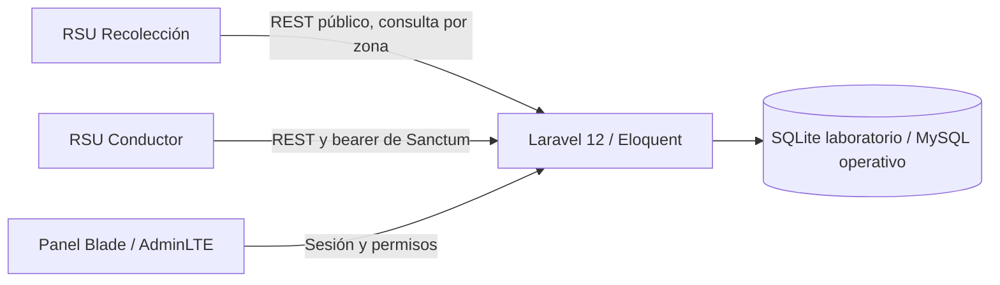
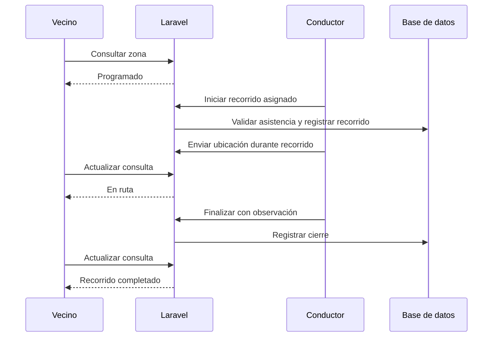
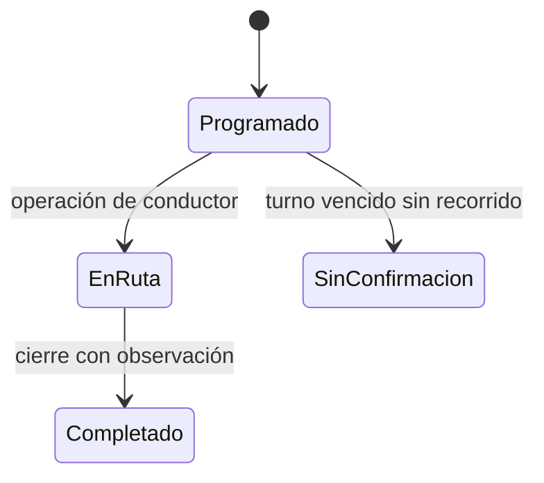

# Arquitectura

```mermaid
flowchart LR
  Vecino["RSU Recolección"] -->|"REST público, consulta por zona"| Laravel
  Conductor["RSU Conductor"] -->|"REST y bearer de Sanctum"| Laravel
  Panel["Panel Blade / AdminLTE"] -->|"Sesión y permisos"| Laravel
  Laravel["Laravel 12 / Eloquent"] --> BD[("SQLite laboratorio / MySQL operativo")]
```

```mermaid
sequenceDiagram
  participant V as Vecino
  participant S as Laravel
  participant C as Conductor
  participant B as Base de datos
  V->>S: Consultar zona
  S-->>V: Programado
  C->>S: Iniciar recorrido asignado
  S->>B: Validar asistencia y registrar recorrido
  C->>S: Enviar ubicación durante recorrido
  V->>S: Actualizar consulta
  S-->>V: En ruta
  C->>S: Finalizar con observación
  S->>B: Registrar cierre
  V->>S: Actualizar consulta
  S-->>V: Recorrido completado
```

```mermaid
stateDiagram-v2
  [*] --> Programado
  Programado --> EnRuta: operación de conductor
  EnRuta --> Completado: cierre con observación
  Programado --> SinConfirmacion: turno vencido sin recorrido
```

El diagrama representa la proyección de consulta. Los recorridos y las programaciones conservan sus estados en tablas distintas.
